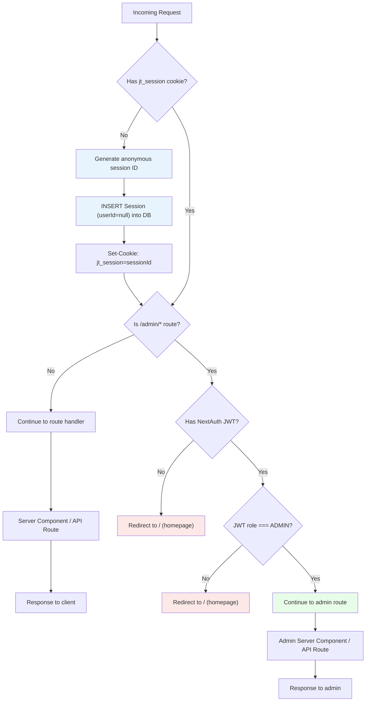
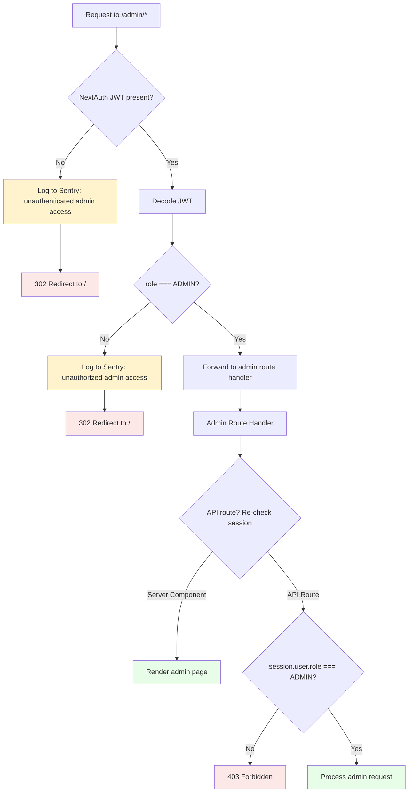

# Auth Specification

**Project:** Japanoma — Buyer Insight Platform for Japan Property Investment
**Version:** 1.0
**Date:** 2026-02-27
**Author:** Obi (Technical Lead, Craefto)

---

## 1. Auth Architecture

Japanoma uses a two-layer authentication architecture, reflecting the platform's anonymous-first design. The vast majority of visitors (95%+) will never create an account; they browse content, take quizzes, and save items without authenticating. The auth system is engineered so that every visitor produces useful behavioral signal from their first page load, with optional registration available for users who want persistent saves across devices.

The two layers operate independently but share the same PostgreSQL database via Supabase.

### Layer 1: Anonymous Sessions

A custom session cookie (`jt_session`) is generated by Next.js middleware on the visitor's first request when no existing session cookie is detected. This cookie serves as the sole attribution key for all event tracking, quiz responses, and anonymous saves. No authentication is required. The session record is stored in the `Session` table with `userId` set to `null`, indicating an unlinked anonymous session.

This layer is classified as an essential cookie under GDPR Article 5(3), APPI, and the Australian Privacy Act, meaning it does not require consent to set. It is a first-party, httpOnly, secure cookie that exists solely for site functionality. See [ADR-012](../adr/012-privacy-compliance.md) for the full privacy compliance rationale.

### Layer 2: NextAuth.js v5 (Optional Authentication)

When a visitor chooses to register or log in (to persist saves across devices, link quiz results to a profile, or access admin features), NextAuth.js v5 handles email/password authentication via the Credentials provider. The Supabase database adapter writes user and session records to the same PostgreSQL instance. JWT strategy is used for authenticated sessions, with the user's `id`, `email`, `name`, and `role` encoded in the token.

This layer is entirely optional for the public-facing site. The only routes that require Layer 2 authentication are `/admin/*` (restricted to ADMIN role) and `/saved` when the user wants to view database-persisted saves.

See [ADR-003](../adr/003-auth-strategy.md) for the decision rationale and alternatives considered.

### Request Flow

The following diagram shows how an incoming request flows through the middleware layer, session resolution, and route handling.



## 2. Session Management

### Anonymous Sessions

Anonymous sessions are the foundation of Japanoma's event tracking system. Every visitor receives a session on their first request, enabling immediate behavioral signal collection.

**Generation:**
- Created by Next.js middleware when an incoming request has no `jt_session` cookie
- A cryptographically random session token is generated (e.g., via `crypto.randomUUID()`)

**Cookie Configuration:**
| Property | Value |
|----------|-------|
| Name | `jt_session` |
| Value | Cryptographically random UUID |
| httpOnly | `true` |
| secure | `true` (HTTPS only) |
| sameSite | `lax` |
| path | `/` |
| maxAge | 7,776,000 seconds (90 days) |

**Database Record:**
The session is persisted in the `Session` table immediately upon creation:
```
{
  id:           uuid (primary key),
  sessionToken: string (matches cookie value),
  userId:       null (no authenticated user),
  expiresAt:    now() + 90 days,
  createdAt:    now()
}
```

**Usage:**
- Event tracking attribution: every event sent to `/api/events` includes the `sessionId` from this cookie
- Quiz response association: quiz submissions reference the anonymous session
- Anonymous saves: while saves are stored in localStorage on the client, save/unsave events are tracked server-side against this session

**Expiry and Cleanup:**
- Sessions expire 90 days from creation
- A daily cron job (scheduled at 02:00 AEST) deletes expired sessions: `DELETE FROM sessions WHERE expiresAt < now()`
- This same cron handles raw event data retention (events older than 90 days are pruned after aggregation into `DailyAreaStats` and `DailyTaxonomyStats`)

### Authenticated Sessions

Authenticated sessions are created by NextAuth.js v5 when a user registers or logs in via email/password.

**Strategy:** JWT (JSON Web Token)

**JWT Payload:**
```
{
  id:    string (User.id from database),
  email: string,
  name:  string,
  role:  "USER" | "ADMIN"
}
```

The `role` field is injected into the JWT via the NextAuth.js `jwt` callback, reading from the `User` record in the database. The `session` callback then exposes these fields to the client-accessible session object.

**Cookie Configuration:**
| Property | Value |
|----------|-------|
| Name | `next-auth.session-token` (production) or `__Secure-next-auth.session-token` |
| httpOnly | `true` |
| secure | `true` |
| sameSite | `lax` |
| path | `/` |

**Database Link:**
The authenticated session is linked to a `User` record in the database. The `User` record contains:
```
{
  id:        uuid (primary key),
  email:     string (unique),
  name:      string,
  password:  string (bcrypt hashed),
  role:      "USER" | "ADMIN" (default: "USER"),
  createdAt: timestamp,
  updatedAt: timestamp
}
```

**Coexistence with Anonymous Sessions:**
When a user is authenticated, both cookies (`jt_session` and `next-auth.session-token`) coexist. The `jt_session` cookie continues to serve as the event tracking attribution key. The NextAuth session provides identity and role information. API routes check both as appropriate: event ingestion uses `jt_session`; save persistence and admin access use the NextAuth session.

### Session Migration Flow

Session migration is the process of transferring an anonymous visitor's accumulated data to a newly created user account. This is a critical path that preserves the user's history and eliminates data loss on registration.

**Trigger:** User submits the registration form (email, password, consent).

**Steps:**

1. Read the anonymous `sessionId` from the `jt_session` cookie on the incoming registration request
2. Create the `User` record in the database (email, hashed password, role=USER)
3. Update the anonymous session record: `UPDATE sessions SET userId = newUser.id WHERE sessionToken = anonymousToken`
4. Client sends localStorage saved items in the registration payload; server inserts them: `INSERT INTO saves (userId, contentId, contentType, createdAt) VALUES (...) for each item`
5. Optionally enrich historical events: `UPDATE events SET userId = newUser.id WHERE sessionId = anonymousSessionId` (this links prior anonymous behavior to the new user for richer analytics, but is not required for core functionality)
6. Client clears localStorage saved items after receiving a successful registration response
7. NextAuth.js creates the authenticated session (JWT issued, `next-auth.session-token` cookie set)

```mermaid
sequenceDiagram
    participant C as Client Browser
    participant MW as Next.js Middleware
    participant Auth as NextAuth.js
    participant API as /api/auth/register
    participant DB as PostgreSQL

    Note over C: User has been browsing anonymously<br/>jt_session cookie = "anon-token-123"<br/>localStorage has 3 saved items

    C->>API: POST /api/auth/register
    Note right of C: { email, password, consent: true,<br/>savedItems: ["content-1", "content-2", "content-3"] }<br/>Cookie: jt_session=anon-token-123 (httpOnly)

    API->>API: Validate with Zod schema
    API->>DB: INSERT INTO users (email, password, role)
    DB-->>API: newUser { id: "user-456" }

    API->>DB: UPDATE sessions SET userId = "user-456"<br/>WHERE sessionToken = "anon-token-123"
    DB-->>API: Session linked

    loop For each saved item
        API->>DB: INSERT INTO saves (userId, contentId)
    end

    API->>DB: UPDATE events SET userId = "user-456"<br/>WHERE sessionId = (SELECT id FROM sessions<br/>WHERE sessionToken = "anon-token-123")
    DB-->>API: Events enriched

    API->>Auth: Create authenticated session
    Auth-->>C: Set-Cookie: next-auth.session-token=jwt-xyz

    C->>C: Clear localStorage savedItems
    C->>C: Redirect to /saved (persistent saves now visible)
```



## 3. Role Hierarchy

Japanoma defines three roles in a strict hierarchy. Each higher role inherits all capabilities of the roles below it.

### Visitor (Anonymous)

A Visitor is any person who accesses the site without a user account. They are identified solely by their anonymous session (`jt_session` cookie). Visitors represent the vast majority of the platform's traffic.

**Capabilities:**
- Browse all public content pages (area guides, articles, content hub)
- View area detail pages with property insights
- Take quizzes (area preference, use case, design style) and receive recommendations
- Save content items to localStorage (client-side only, not persisted across devices)
- Submit events (page views, saves, quiz completions) for analytics tracking (subject to consent)
- Submit the contact form (requires providing an email address inline, since no account exists)

**Limitations:**
- No persistent saves across devices or browsers
- No database-stored quiz results
- No access to admin routes or analytics

### User (Registered)

A User is a Visitor who has created an account via email/password registration. Their `User` record has `role = 'USER'`. Registration is entirely optional and exists primarily for users who want their saves and quiz results to persist across devices.

**Capabilities (in addition to Visitor):**
- Persistent saves stored in the database, accessible from any device
- Saved quiz results stored in the database and viewable in their profile
- Contact form submissions linked to their user profile (no need to re-enter email)
- Account management (update name, email; request account deletion)

**Limitations:**
- No access to admin routes or analytics dashboard
- No data export capabilities

### Admin

An Admin is a User with `role = 'ADMIN'` in the database. Admin accounts are not created through self-service registration. Kaz and Shiun are the designated Admin users, set manually via database seed or direct `UPDATE` statement.

**Capabilities (in addition to User):**
- Access all `/admin/*` routes
- View the analytics dashboard (area demand trends, use case distributions, design preferences, pricing analysis)
- View cross-tabulation reports (area by use case, area by budget range, etc.)
- Export data in CSV and PDF formats
- View aggregated user profiles and inquiry submissions
- Manage content taxonomy tags (via Sanity Studio, which is separately authenticated)

**No self-service admin creation.** Adding a new Admin requires a database operation:
```sql
UPDATE users SET role = 'ADMIN' WHERE email = 'newadmin@example.com';
```

## 4. Permission Matrix

The following table defines the complete permission matrix for all features and routes in the Japanoma platform.

| Feature / Route | Visitor (anonymous) | User (registered) | Admin |
|---|---|---|---|
| Browse content pages | Yes | Yes | Yes |
| View area pages | Yes | Yes | Yes |
| Take quizzes | Yes | Yes | Yes |
| Save to localStorage | Yes | Yes | Yes |
| Save to database | No | Yes | Yes |
| Submit contact form | Yes (with email field) | Yes (linked to profile) | Yes |
| View saved items (DB) | No | Yes | Yes |
| View quiz results (DB) | No | Yes | Yes |
| Access `/admin/*` | No (redirect to `/`) | No (redirect to `/`) | Yes |
| View dashboard analytics | No | No | Yes |
| Export data (CSV/PDF) | No | No | Yes |
| Manage content (CMS) | No | No | Yes (via Sanity Studio) |
| View user profiles | No | No | Yes |

**Route protection summary:**

| Route Pattern | Required Role | Protection Layer |
|---|---|---|
| `/` , `/areas/*`, `/content/*`, `/quiz/*`, `/compare`, `/contact` | None (public) | No auth check |
| `/saved` | None (public), but DB saves require USER or ADMIN | Client-side: shows localStorage saves for Visitors, DB saves for authenticated users |
| `/admin/*` | ADMIN | Middleware JWT role check + API route role check |
| `/api/events` | None (public) | Anonymous session required (jt_session cookie) |
| `/api/saves` | USER or ADMIN | NextAuth session required |
| `/api/quiz/*` | None (public) | Anonymous session required for submission |
| `/api/contact` | None (public) | Zod validation + rate limiting |
| `/api/admin/*` | ADMIN | NextAuth session + role check |

## 5. Admin Access Control

Admin access is tightly controlled through multiple layers of protection. The admin dashboard contains aggregated analytics data that represents the core business value of the Japanoma platform.

### Admin User Provisioning

- Admin users are identified by `role: 'ADMIN'` in the `User` table
- Initial admin users (Kaz and Shiun) are created via database seed script or manual `INSERT` statement during deployment
- There is no self-service admin registration endpoint. The `/api/auth/register` route always creates users with `role = 'USER'`
- Promoting a user to admin requires direct database access:
  ```sql
  UPDATE users SET role = 'ADMIN' WHERE email = 'kaz@goandcpartners.com';
  UPDATE users SET role = 'ADMIN' WHERE email = 'shiun@goandcpartners.com';
  ```

### Two-Level Route Protection

Admin routes are protected at two independent levels, providing defense in depth.

**Level 1: Next.js Middleware (Edge)**
The middleware intercepts all requests matching `/admin/*` before they reach any route handler. It reads the NextAuth JWT from the `next-auth.session-token` cookie, decodes it, and checks the `role` claim. If the role is not `ADMIN`, the request is redirected to `/` (homepage). If no JWT is present, the request is also redirected to `/`.

**Level 2: API Route Guards**
All API routes under `/api/admin/*` independently verify the session role before processing any request. This ensures that even if middleware is bypassed (e.g., during development, or via a direct API call), the data layer remains protected.

```typescript
// Example: /api/admin/analytics/route.ts
const session = await auth();
if (!session?.user?.role || session.user.role !== 'ADMIN') {
  return NextResponse.json({ error: 'Forbidden' }, { status: 403 });
}
```

### Admin Session Timeout

**Regular users:** JWT tokens expire after 7 days (604,800 seconds), configured via the NextAuth `session.maxAge` option. This balances convenience (users don't need to re-login daily) with security.

**Admin users:** Admin sessions have a 24-hour timeout enforced via the JWT `exp` claim. After 24 hours, the admin must re-authenticate. This is shorter than the regular user session duration and is configured via custom logic in the `jwt` callback that checks the user's role and overrides `maxAge` accordingly.

### Failed Access Logging

Failed admin access attempts (non-ADMIN users or unauthenticated requests to `/admin/*` or `/api/admin/*`) are logged to Sentry as warning-level events. The log includes:
- Timestamp
- Requested path
- User ID (if authenticated) or "anonymous"
- IP address (for abuse detection)

This provides an audit trail without storing sensitive data in application logs.

### Middleware Protection Flow



## 6. Security Measures

### CSRF Protection

**NextAuth.js Built-in CSRF:**
NextAuth.js v5 provides built-in CSRF token validation for all authentication endpoints (`/api/auth/*`). Every form submission to NextAuth routes includes a CSRF token that is validated server-side against a token stored in the session cookie. This protects login, registration, and session management endpoints.

**Custom API Route CSRF:**
All state-changing custom API routes (POST, PUT, DELETE to `/api/events`, `/api/saves`, `/api/contact`, `/api/quiz/*`, `/api/admin/*`) require a valid session. For anonymous routes that rely on `jt_session` rather than NextAuth, a custom CSRF token header check is implemented:
- The server generates a CSRF token and includes it in the page response (via a meta tag or a dedicated endpoint)
- Client-side fetch calls include the token in an `X-CSRF-Token` header
- The API route validates the token before processing the request

**SameSite Cookie Policy:**
Both `jt_session` and `next-auth.session-token` cookies use `sameSite=lax`, which prevents the browser from sending these cookies on cross-origin POST requests, providing a baseline layer of CSRF protection.

### Rate Limiting

Rate limits are enforced per client IP address to prevent abuse of API endpoints. The implementation uses an in-memory rate limiter for v1 (via `@upstash/ratelimit` with an in-memory adapter or a lightweight custom implementation). If traffic volume requires distributed rate limiting across multiple serverless instances, Upstash Redis ($0 on free tier, usage-based beyond that) can be introduced as the backing store without changing the API.

| Endpoint Type | Limit | Window |
|---|---|---|
| `/api/events` | 60 requests | 1 minute |
| `/api/auth/*` | 10 requests | 1 minute |
| `/api/contact` | 5 requests | 5 minutes |
| `/api/quiz/*` | 20 requests | 1 minute |
| `/api/admin/*` | 30 requests | 1 minute |
| `/api/saves` | 30 requests | 1 minute |

**Implementation details:**
- Rate limiter is applied in Next.js middleware or as a wrapper in API route handlers
- When a client exceeds the rate limit, the API returns `429 Too Many Requests` with a `Retry-After` header
- Rate limit counters are keyed by IP address and endpoint pattern
- Admin endpoints have a separate limit because admin users (Kaz, Shiun) may perform batch operations during data review sessions

### Input Validation

All API routes validate incoming request bodies using Zod schemas. This provides type-safe validation at the boundary between client and server.

**Validation strategy:**
- Zod schemas are defined in a shared `lib/validations/` directory, enabling the same schema to be used for client-side form validation and server-side request validation
- Every API route parses the request body with `schema.safeParse(body)` before processing
- Invalid requests return a `400 Bad Request` response with a structured error object:
  ```json
  {
    "error": "Validation failed",
    "issues": [
      { "path": ["email"], "message": "Invalid email format" }
    ]
  }
  ```
- No raw user input is interpolated into SQL queries. Drizzle ORM parameterizes all queries automatically, preventing SQL injection
- String fields are trimmed and length-limited at the Zod schema level
- Enum fields (e.g., `eventType`, `quizType`, `role`) are validated against allowed values

### Privacy Safeguards

The auth and tracking systems are designed with data minimization as a core principle, in compliance with the privacy framework defined in [ADR-012](../adr/012-privacy-compliance.md).

**Event table payloads contain no PII:**
The `Event` table stores behavioral signals using only taxonomy identifiers, content IDs, and anonymous session references. An event payload looks like:
```json
{
  "eventType": "CONTENT_VIEW",
  "sessionId": "anon-token-123",
  "payload": {
    "areas": ["hakuba"],
    "prefecture": "nagano",
    "propertyTypes": ["house"],
    "useCases": ["seasonal-living"]
  }
}
```
There is no name, email, IP address, user agent, or other personally identifiable information in event payloads. The `sessionId` is a random UUID with no intrinsic link to a person's identity.

**PII is isolated in separate tables:**
Form submission data (which contains PII such as name, email, and message content) is stored in a dedicated `FormSubmission` table with different access controls. This table is only accessible through `/api/admin/*` routes (ADMIN role required) and is never queried by public-facing API routes.

**Admin dashboard queries against aggregated tables only:**
The admin analytics dashboard queries `DailyAreaStats` and `DailyTaxonomyStats` tables, which contain pre-aggregated counts and distributions. These tables contain no session IDs, user IDs, or any data that could identify an individual visitor. Raw events are aggregated daily and pruned after 90 days.

**Registered user data handling:**
When a user registers, their `User` record stores email, name, and hashed password. This data is accessible to the user (via their profile) and to Admin users (via the admin dashboard). Account deletion removes all user data, linked saves, and linked events, fulfilling the right-of-deletion requirements under GDPR Article 17, APPI, and the Australian Privacy Act.

---

*Cross-references: [ADR-003](../adr/003-auth-strategy.md) (Auth Strategy), [ADR-012](../adr/012-privacy-compliance.md) (Privacy Compliance), [System Overview](system-overview.md), [Data Model](data-model.md)*
