# Data Model

**Project:** Japanoma — Buyer Insight Platform for Japan Property Investment
**Version:** 1.0
**Date:** 2026-02-27
**Author:** Obi (Technical Lead, Craefto)

---

## Overview

This document defines the complete data model for Japanoma, covering taxonomy hierarchies, content relationships, user management, event tracking, and analytics aggregation. All tables are managed via Drizzle ORM (per [ADR-002](../adr/002-database-and-orm.md)) and deployed on Supabase PostgreSQL 16 in the Sydney region.

The schema supports two primary workloads:

1. **Public site queries** — content listing with multi-taxonomy filters, area pages, quiz recommendations
2. **Admin dashboard queries** — cross-tabulation analytics, area demand ranking, trend analysis over time

Custom event tracking with JSONB payloads (per [ADR-005](../adr/005-analytics-tracking.md)) enables SQL joins between event data and taxonomy tables, which is the core analytical capability that distinguishes this platform from off-the-shelf analytics tools.

Cross-references: [system-overview.md](system-overview.md), [ADR-002](../adr/002-database-and-orm.md), [ADR-005](../adr/005-analytics-tracking.md)

---

## 1. Entity-Relationship Diagram

```mermaid
erDiagram
    %% ─── Taxonomy: Geographic Hierarchy ───
    Prefecture {
        uuid id PK
        text name
        text nameJa
        text slug UK
        timestamp createdAt
        timestamp updatedAt
    }

    City {
        uuid id PK
        text name
        text nameJa
        text slug UK
        uuid prefectureId FK
        timestamp createdAt
        timestamp updatedAt
    }

    LocalArea {
        uuid id PK
        text name
        text nameJa
        text slug UK
        uuid cityId FK
        text description
        real latitude
        real longitude
        timestamp createdAt
        timestamp updatedAt
    }

    Prefecture ||--o{ City : "has cities"
    City ||--o{ LocalArea : "has local areas"

    %% ─── Taxonomy: Faceted Dimensions ───
    PropertyType {
        uuid id PK
        text name
        text slug UK
        text description
        timestamp createdAt
        timestamp updatedAt
    }

    UseCase {
        uuid id PK
        text name
        text slug UK
        text description
        timestamp createdAt
        timestamp updatedAt
    }

    RenovationFeature {
        uuid id PK
        text name
        text slug UK
        text description
        timestamp createdAt
        timestamp updatedAt
    }

    DesignStyle {
        uuid id PK
        text name
        text slug UK
        text description
        text imageUrl
        timestamp createdAt
        timestamp updatedAt
    }

    PriceRange {
        uuid id PK
        text label
        text slug UK
        integer minYen
        integer maxYen
        integer minAud
        integer maxAud
        integer sortOrder
        timestamp createdAt
        timestamp updatedAt
    }

    %% ─── Content ───
    Content {
        uuid id PK
        text title
        text slug UK
        text excerpt
        text body
        text featuredImage
        text contentType
        text status
        timestamp publishedAt
        text sanityId UK
        timestamp createdAt
        timestamp updatedAt
    }

    %% ─── Content-Taxonomy Join Tables ───
    ContentToLocalArea {
        uuid contentId FK
        uuid localAreaId FK
    }

    ContentToPropertyType {
        uuid contentId FK
        uuid propertyTypeId FK
    }

    ContentToUseCase {
        uuid contentId FK
        uuid useCaseId FK
    }

    ContentToRenovationFeature {
        uuid contentId FK
        uuid renovationFeatureId FK
    }

    ContentToDesignStyle {
        uuid contentId FK
        uuid designStyleId FK
    }

    ContentToPriceRange {
        uuid contentId FK
        uuid priceRangeId FK
    }

    Content ||--o{ ContentToLocalArea : "tagged with"
    LocalArea ||--o{ ContentToLocalArea : "appears in"
    Content ||--o{ ContentToPropertyType : "tagged with"
    PropertyType ||--o{ ContentToPropertyType : "appears in"
    Content ||--o{ ContentToUseCase : "tagged with"
    UseCase ||--o{ ContentToUseCase : "appears in"
    Content ||--o{ ContentToRenovationFeature : "tagged with"
    RenovationFeature ||--o{ ContentToRenovationFeature : "appears in"
    Content ||--o{ ContentToDesignStyle : "tagged with"
    DesignStyle ||--o{ ContentToDesignStyle : "appears in"
    Content ||--o{ ContentToPriceRange : "tagged with"
    PriceRange ||--o{ ContentToPriceRange : "appears in"

    %% ─── User and Auth ───
    User {
        uuid id PK
        text email UK
        text name
        text password
        text role
        timestamp createdAt
        timestamp updatedAt
    }

    Session {
        uuid id PK
        text sessionToken UK
        uuid userId FK "nullable"
        timestamp expiresAt
        timestamp createdAt
    }

    Account {
        uuid id PK
        uuid userId FK
        text type
        text provider
        text providerAccountId
        text accessToken
        text refreshToken
        integer expiresAt
        text tokenType
        text scope
        text idToken
        text sessionState
    }

    User ||--o{ Session : "has sessions"
    User ||--o{ Account : "has accounts"

    %% ─── Interactions ───
    Save {
        uuid id PK
        uuid userId FK
        uuid contentId FK
        timestamp createdAt
    }

    QuizResponse {
        uuid id PK
        uuid userId FK "nullable"
        uuid sessionId FK
        text quizType
        jsonb responses
        text resultSummary
        timestamp createdAt
    }

    FormSubmission {
        uuid id PK
        uuid userId FK "nullable"
        uuid sessionId FK
        text formType
        jsonb data
        boolean consent
        timestamp createdAt
    }

    User ||--o{ Save : "saves"
    Content ||--o{ Save : "saved by"
    User ||--o{ QuizResponse : "completes"
    Session ||--o{ QuizResponse : "originates from"
    User ||--o{ FormSubmission : "submits"
    Session ||--o{ FormSubmission : "originates from"

    %% ─── Event Tracking ───
    Event {
        uuid id PK
        uuid sessionId FK
        uuid userId FK "nullable"
        text eventType
        jsonb payload
        timestamp createdAt
    }

    ContentView {
        uuid id PK
        uuid contentId FK
        uuid sessionId FK
        integer duration
        timestamp createdAt
    }

    User ||--o{ Event : "enriched with"
    Session ||--o{ Event : "emits"
    Session ||--o{ ContentView : "records"
    Content ||--o{ ContentView : "viewed in"

    %% ─── Aggregation ───
    DailyAreaStats {
        uuid id PK
        date date
        uuid localAreaId FK
        integer views
        integer saves
        integer compares
        integer quizMentions
        timestamp createdAt
    }

    DailyTaxonomyStats {
        uuid id PK
        date date
        text taxonomyType
        uuid taxonomyId
        text taxonomyName
        integer count
        timestamp createdAt
    }

    LocalArea ||--o{ DailyAreaStats : "aggregated in"
```



---

## 2. Data Dictionary

### 2.1 Taxonomy Tables

#### Prefecture

Geographic top level. Japan has 47 prefectures; Japanoma seeds the six most relevant to Australian property buyers.

| Column Name | Type | Constraints | Description |
|-------------|------|-------------|-------------|
| id | uuid | PK, default `gen_random_uuid()` | Primary key |
| name | text | NOT NULL | English name (e.g., "Tokyo") |
| nameJa | text | NOT NULL | Japanese name (e.g., "東京都") |
| slug | text | NOT NULL, UNIQUE | URL-safe identifier (e.g., "tokyo") |
| createdAt | timestamp | NOT NULL, default `now()` | Row creation time |
| updatedAt | timestamp | NOT NULL, default `now()` | Last update time |

**Indexes:** Unique index on `slug`.
**Access control:** Public read. Admin write via seed scripts only.

---

#### City

Second-level geography. Each city belongs to exactly one prefecture.

| Column Name | Type | Constraints | Description |
|-------------|------|-------------|-------------|
| id | uuid | PK, default `gen_random_uuid()` | Primary key |
| name | text | NOT NULL | English name (e.g., "Hakone") |
| nameJa | text | NOT NULL | Japanese name (e.g., "箱根町") |
| slug | text | NOT NULL, UNIQUE | URL-safe identifier (e.g., "hakone") |
| prefectureId | uuid | NOT NULL, FK to `prefecture.id` | Parent prefecture |
| createdAt | timestamp | NOT NULL, default `now()` | Row creation time |
| updatedAt | timestamp | NOT NULL, default `now()` | Last update time |

**Indexes:** Unique index on `slug`. Index on `prefectureId`.
**Access control:** Public read. Admin write via seed scripts only.

---

#### LocalArea

Granular neighborhood or district within a city. This is the primary geographic unit for content tagging and analytics.

| Column Name | Type | Constraints | Description |
|-------------|------|-------------|-------------|
| id | uuid | PK, default `gen_random_uuid()` | Primary key |
| name | text | NOT NULL | English name (e.g., "Hakuba Village") |
| nameJa | text | NOT NULL | Japanese name (e.g., "白馬村") |
| slug | text | NOT NULL, UNIQUE | URL-safe identifier (e.g., "hakuba") |
| cityId | uuid | NOT NULL, FK to `city.id` | Parent city |
| description | text | | Brief area description for SEO |
| latitude | real | | Center-point latitude for map display |
| longitude | real | | Center-point longitude for map display |
| createdAt | timestamp | NOT NULL, default `now()` | Row creation time |
| updatedAt | timestamp | NOT NULL, default `now()` | Last update time |

**Indexes:** Unique index on `slug`. Index on `cityId`.
**Access control:** Public read. Admin write via seed scripts only.

---

#### PropertyType

Classification of property types available in the Japanese real estate market.

| Column Name | Type | Constraints | Description |
|-------------|------|-------------|-------------|
| id | uuid | PK, default `gen_random_uuid()` | Primary key |
| name | text | NOT NULL | Display name (e.g., "Akiya (Vacant House)") |
| slug | text | NOT NULL, UNIQUE | URL-safe identifier (e.g., "akiya") |
| description | text | | Explanatory text for the property type |
| createdAt | timestamp | NOT NULL, default `now()` | Row creation time |
| updatedAt | timestamp | NOT NULL, default `now()` | Last update time |

**Indexes:** Unique index on `slug`.
**Access control:** Public read. Admin write via seed scripts only.

---

#### UseCase

Buyer lifestyle or investment intent categories.

| Column Name | Type | Constraints | Description |
|-------------|------|-------------|-------------|
| id | uuid | PK, default `gen_random_uuid()` | Primary key |
| name | text | NOT NULL | Display name (e.g., "Seasonal Living") |
| slug | text | NOT NULL, UNIQUE | URL-safe identifier (e.g., "seasonal-living") |
| description | text | | Explanatory text for the use case |
| createdAt | timestamp | NOT NULL, default `now()` | Row creation time |
| updatedAt | timestamp | NOT NULL, default `now()` | Last update time |

**Indexes:** Unique index on `slug`.
**Access control:** Public read. Admin write via seed scripts only.

---

#### RenovationFeature

Renovation and improvement categories relevant to Japanese properties.

| Column Name | Type | Constraints | Description |
|-------------|------|-------------|-------------|
| id | uuid | PK, default `gen_random_uuid()` | Primary key |
| name | text | NOT NULL | Display name (e.g., "Energy Efficiency Upgrade") |
| slug | text | NOT NULL, UNIQUE | URL-safe identifier |
| description | text | | Explanatory text for the feature |
| createdAt | timestamp | NOT NULL, default `now()` | Row creation time |
| updatedAt | timestamp | NOT NULL, default `now()` | Last update time |

**Indexes:** Unique index on `slug`.
**Access control:** Public read. Admin write via seed scripts only.

---

#### DesignStyle

Architectural and interior design aesthetics that appeal to Australian buyers exploring Japanese property.

| Column Name | Type | Constraints | Description |
|-------------|------|-------------|-------------|
| id | uuid | PK, default `gen_random_uuid()` | Primary key |
| name | text | NOT NULL | Display name (e.g., "Japandi") |
| slug | text | NOT NULL, UNIQUE | URL-safe identifier (e.g., "japandi") |
| description | text | | Explanatory text for the style |
| imageUrl | text | | Representative image URL (Sanity CDN) |
| createdAt | timestamp | NOT NULL, default `now()` | Row creation time |
| updatedAt | timestamp | NOT NULL, default `now()` | Last update time |

**Indexes:** Unique index on `slug`.
**Access control:** Public read. Admin write via seed scripts only.

---

#### PriceRange

Budget bands expressed in both JPY and AUD. Used for content tagging and budget selection tracking.

| Column Name | Type | Constraints | Description |
|-------------|------|-------------|-------------|
| id | uuid | PK, default `gen_random_uuid()` | Primary key |
| label | text | NOT NULL | Display label (e.g., "Under 5M") |
| slug | text | NOT NULL, UNIQUE | URL-safe identifier (e.g., "under-5m") |
| minYen | integer | | Lower bound in JPY (null for lowest band) |
| maxYen | integer | | Upper bound in JPY (null for highest band) |
| minAud | integer | | Lower bound in AUD (approximate conversion) |
| maxAud | integer | | Upper bound in AUD (approximate conversion) |
| sortOrder | integer | NOT NULL | Display ordering (ascending) |
| createdAt | timestamp | NOT NULL, default `now()` | Row creation time |
| updatedAt | timestamp | NOT NULL, default `now()` | Last update time |

**Indexes:** Unique index on `slug`. Index on `sortOrder`.
**Access control:** Public read. Admin write via seed scripts only.

---

### 2.2 Content Tables

#### Content

Central content entity. Synced from Sanity CMS via webhook on publish. The `sanityId` links back to the CMS source of truth; the local copy enables SQL joins with taxonomy and event data.

| Column Name | Type | Constraints | Description |
|-------------|------|-------------|-------------|
| id | uuid | PK, default `gen_random_uuid()` | Primary key |
| title | text | NOT NULL | Content title |
| slug | text | NOT NULL, UNIQUE | URL path segment |
| excerpt | text | | Short summary for cards and SEO meta description |
| body | text | | Full content body (Portable Text serialized to HTML) |
| featuredImage | text | | Featured image URL (Sanity CDN) |
| contentType | text | NOT NULL | Enum: `ContentType` (see Section 3) |
| status | text | NOT NULL, default `'DRAFT'` | Enum: `ContentStatus` (see Section 3) |
| publishedAt | timestamp | | Publication timestamp (set by CMS) |
| sanityId | text | UNIQUE | Sanity document `_id` for deduplication |
| createdAt | timestamp | NOT NULL, default `now()` | Row creation time |
| updatedAt | timestamp | NOT NULL, default `now()` | Last update time |

**Indexes:** Unique index on `slug`. Unique index on `sanityId`. Index on `status, publishedAt` for listing queries. Index on `contentType`.
**Access control:** Public read for `PUBLISHED` status. Admin read for all statuses.

---

#### ContentToLocalArea

Join table linking content to geographic areas. A content item can be tagged with multiple local areas (e.g., an article covering "Best ski areas in Nagano" tags Hakuba, Nozawa Onsen, and Shiga Kogen).

| Column Name | Type | Constraints | Description |
|-------------|------|-------------|-------------|
| contentId | uuid | NOT NULL, FK to `content.id`, ON DELETE CASCADE | Content reference |
| localAreaId | uuid | NOT NULL, FK to `local_area.id`, ON DELETE CASCADE | Local area reference |

**Indexes:** Composite primary key on `(contentId, localAreaId)`.
**Access control:** Follows content access rules.

---

#### ContentToPropertyType

| Column Name | Type | Constraints | Description |
|-------------|------|-------------|-------------|
| contentId | uuid | NOT NULL, FK to `content.id`, ON DELETE CASCADE | Content reference |
| propertyTypeId | uuid | NOT NULL, FK to `property_type.id`, ON DELETE CASCADE | Property type reference |

**Indexes:** Composite primary key on `(contentId, propertyTypeId)`.

---

#### ContentToUseCase

| Column Name | Type | Constraints | Description |
|-------------|------|-------------|-------------|
| contentId | uuid | NOT NULL, FK to `content.id`, ON DELETE CASCADE | Content reference |
| useCaseId | uuid | NOT NULL, FK to `use_case.id`, ON DELETE CASCADE | Use case reference |

**Indexes:** Composite primary key on `(contentId, useCaseId)`.

---

#### ContentToRenovationFeature

| Column Name | Type | Constraints | Description |
|-------------|------|-------------|-------------|
| contentId | uuid | NOT NULL, FK to `content.id`, ON DELETE CASCADE | Content reference |
| renovationFeatureId | uuid | NOT NULL, FK to `renovation_feature.id`, ON DELETE CASCADE | Renovation feature reference |

**Indexes:** Composite primary key on `(contentId, renovationFeatureId)`.

---

#### ContentToDesignStyle

| Column Name | Type | Constraints | Description |
|-------------|------|-------------|-------------|
| contentId | uuid | NOT NULL, FK to `content.id`, ON DELETE CASCADE | Content reference |
| designStyleId | uuid | NOT NULL, FK to `design_style.id`, ON DELETE CASCADE | Design style reference |

**Indexes:** Composite primary key on `(contentId, designStyleId)`.

---

#### ContentToPriceRange

| Column Name | Type | Constraints | Description |
|-------------|------|-------------|-------------|
| contentId | uuid | NOT NULL, FK to `content.id`, ON DELETE CASCADE | Content reference |
| priceRangeId | uuid | NOT NULL, FK to `price_range.id`, ON DELETE CASCADE | Price range reference |

**Indexes:** Composite primary key on `(contentId, priceRangeId)`.

---

### 2.3 User and Auth Tables

#### User

Registered users. Most visitors remain anonymous (session-only). Registration is optional and enables persistent saves and quiz history.

| Column Name | Type | Constraints | Description |
|-------------|------|-------------|-------------|
| id | uuid | PK, default `gen_random_uuid()` | Primary key |
| email | text | NOT NULL, UNIQUE | User email address |
| name | text | | Display name |
| password | text | NOT NULL | Bcrypt-hashed password |
| role | text | NOT NULL, default `'USER'` | Enum: `UserRole` (see Section 3) |
| createdAt | timestamp | NOT NULL, default `now()` | Row creation time |
| updatedAt | timestamp | NOT NULL, default `now()` | Last update time |

**Indexes:** Unique index on `email`.
**Access control:** User can read own record (password excluded from all queries). Admin can read all (password excluded).

---

#### Session

Tracks both anonymous and authenticated sessions. Anonymous sessions are created by Next.js middleware on first visit (see [system-overview.md](system-overview.md), Section 4.1). Authenticated sessions link to a user via `userId`.

| Column Name | Type | Constraints | Description |
|-------------|------|-------------|-------------|
| id | uuid | PK, default `gen_random_uuid()` | Primary key |
| sessionToken | text | NOT NULL, UNIQUE | Opaque token stored in `jt_session` cookie |
| userId | uuid | FK to `user.id`, nullable | Linked user (null for anonymous) |
| expiresAt | timestamp | NOT NULL | Session expiration time |
| createdAt | timestamp | NOT NULL, default `now()` | Row creation time |

**Indexes:** Unique index on `sessionToken`. Index on `userId`. Index on `expiresAt` for cleanup queries.
**Access control:** Internal only. Never exposed via public API.

---

#### Account

NextAuth.js adapter table for OAuth provider accounts. Stores provider tokens for social login flows.

| Column Name | Type | Constraints | Description |
|-------------|------|-------------|-------------|
| id | uuid | PK, default `gen_random_uuid()` | Primary key |
| userId | uuid | NOT NULL, FK to `user.id`, ON DELETE CASCADE | Owning user |
| type | text | NOT NULL | Account type (e.g., "oauth", "email") |
| provider | text | NOT NULL | Provider name (e.g., "google", "credentials") |
| providerAccountId | text | NOT NULL | ID from the provider |
| accessToken | text | | OAuth access token |
| refreshToken | text | | OAuth refresh token |
| expiresAt | integer | | Token expiration as Unix timestamp (seconds since epoch), per NextAuth adapter convention |
| tokenType | text | | Token type (e.g., "Bearer") |
| scope | text | | Granted OAuth scopes |
| idToken | text | | OIDC ID token |
| sessionState | text | | Session state from provider |

**Indexes:** Unique composite index on `(provider, providerAccountId)`. Index on `userId`.
**Access control:** Internal only. Never exposed via API.

---

### 2.4 Interaction Tables

#### Save

Persistent bookmarks for authenticated users. Anonymous saves are stored in `localStorage` and migrated on registration (see [system-overview.md](system-overview.md), Section 4.3).

| Column Name | Type | Constraints | Description |
|-------------|------|-------------|-------------|
| id | uuid | PK, default `gen_random_uuid()` | Primary key |
| userId | uuid | NOT NULL, FK to `user.id`, ON DELETE CASCADE | User who saved |
| contentId | uuid | NOT NULL, FK to `content.id`, ON DELETE CASCADE | Saved content item |
| createdAt | timestamp | NOT NULL, default `now()` | Time of save action |

**Indexes:** Unique composite index on `(userId, contentId)` to prevent duplicate saves. Index on `userId` for listing saved items. Index on `contentId` for popularity metrics.
**Access control:** User can read/write own saves. Admin can read all.

---

#### QuizResponse

Stores completed quiz responses with full answer data in JSONB. Linked to session (always) and user (if authenticated). The `resultSummary` stores the computed recommendation as a human-readable string.

| Column Name | Type | Constraints | Description |
|-------------|------|-------------|-------------|
| id | uuid | PK, default `gen_random_uuid()` | Primary key |
| userId | uuid | FK to `user.id`, nullable | User if authenticated |
| sessionId | uuid | NOT NULL, FK to `session.id` | Originating session |
| quizType | text | NOT NULL | Enum: `QuizType` (see Section 3) |
| responses | jsonb | NOT NULL | Full quiz answers as key-value pairs |
| resultSummary | text | | Computed recommendation summary |
| createdAt | timestamp | NOT NULL, default `now()` | Submission time |

**Indexes:** Index on `quizType`. Index on `sessionId`. Index on `createdAt`.
**Access control:** Admin read only. Users cannot query other users' responses.

---

#### FormSubmission

Contact and inquiry form submissions. Stores PII (name, email, message) alongside structured interest data. The `consent` field records explicit user consent per [ADR-012](../adr/012-privacy-compliance.md).

| Column Name | Type | Constraints | Description |
|-------------|------|-------------|-------------|
| id | uuid | PK, default `gen_random_uuid()` | Primary key |
| userId | uuid | FK to `user.id`, nullable | User if authenticated |
| sessionId | uuid | NOT NULL, FK to `session.id` | Originating session |
| formType | text | NOT NULL | Enum: `FormType` (see Section 3) |
| data | jsonb | NOT NULL | Form payload (name, email, message, interests) |
| consent | boolean | NOT NULL, default `false` | Explicit consent to data processing |
| createdAt | timestamp | NOT NULL, default `now()` | Submission time |

**Indexes:** Index on `formType`. Index on `createdAt`.
**Access control:** Admin read only. Contains PII; subject to data retention policy.

---

### 2.5 Event Tracking Tables

#### Event

Raw event log for buyer signal tracking. Each row captures a single user interaction with a JSONB payload containing taxonomy-tagged context. This is the primary data source for the admin dashboard analytics pipeline.

See Section 5 for detailed payload schemas per event type.

| Column Name | Type | Constraints | Description |
|-------------|------|-------------|-------------|
| id | uuid | PK, default `gen_random_uuid()` | Primary key |
| sessionId | uuid | NOT NULL, FK to `session.id` | Originating session |
| userId | uuid | FK to `user.id`, nullable | Linked user (set during session migration; null for anonymous events) |
| eventType | text | NOT NULL | Enum: `EventType` (see Section 3) |
| payload | jsonb | NOT NULL, default `'{}'` | Event-specific data (see Section 5) |
| createdAt | timestamp | NOT NULL, default `now()` | Event timestamp |

**Indexes:** Composite index on `(eventType, createdAt)` for aggregation queries. Index on `sessionId` for session replay. Index on `createdAt` for retention cleanup. Index on `userId` for user-linked event queries.
**Access control:** Write via `/api/events` (rate limited). Admin read only for dashboard.
**Retention:** Raw events retained for 90 days, then deleted by daily cron job.

---

#### ContentView

Dedicated table for content view tracking with duration. Separated from the general `Event` table to enable efficient content popularity queries without scanning the full event log.

| Column Name | Type | Constraints | Description |
|-------------|------|-------------|-------------|
| id | uuid | PK, default `gen_random_uuid()` | Primary key |
| contentId | uuid | NOT NULL, FK to `content.id`, ON DELETE CASCADE | Viewed content |
| sessionId | uuid | NOT NULL, FK to `session.id` | Viewing session |
| duration | integer | | Time on page in seconds (updated via beacon) |
| createdAt | timestamp | NOT NULL, default `now()` | View start time |

**Indexes:** Composite index on `(contentId, createdAt)` for popularity ranking. Index on `sessionId`.
**Access control:** Write via `/api/events`. Admin read only.
**Retention:** Raw views retained for 90 days alongside events.

---

### 2.6 Aggregation Tables

#### DailyAreaStats

Pre-computed daily aggregates per local area. Populated by a cron job that runs at 2:00 AM AEST (see Section 5, Aggregation Strategy). These tables power the admin dashboard with sub-second query response times.

| Column Name | Type | Constraints | Description |
|-------------|------|-------------|-------------|
| id | uuid | PK, default `gen_random_uuid()` | Primary key |
| date | date | NOT NULL | Aggregation date |
| localAreaId | uuid | NOT NULL, FK to `local_area.id` | Area being measured |
| views | integer | NOT NULL, default `0` | Content views mentioning this area |
| saves | integer | NOT NULL, default `0` | Save actions on content tagged with this area |
| compares | integer | NOT NULL, default `0` | Comparison actions involving this area |
| quizMentions | integer | NOT NULL, default `0` | Quiz results recommending this area |
| createdAt | timestamp | NOT NULL, default `now()` | Row creation time |

**Indexes:** Unique composite index on `(date, localAreaId)` for upsert operations. Index on `localAreaId` for area-specific queries. Index on `date` for time-range queries.
**Access control:** Admin read only. Written by cron job only.
**Retention:** Indefinite. Aggregated data is compact and does not require cleanup.

---

#### DailyTaxonomyStats

Pre-computed daily aggregates per taxonomy dimension. Captures signal counts for any taxonomy type (area, propertyType, useCase, designStyle, priceRange) in a single flexible table.

| Column Name | Type | Constraints | Description |
|-------------|------|-------------|-------------|
| id | uuid | PK, default `gen_random_uuid()` | Primary key |
| date | date | NOT NULL | Aggregation date |
| taxonomyType | text | NOT NULL | Dimension name (e.g., "area", "propertyType", "useCase") |
| taxonomyId | uuid | NOT NULL | ID of the taxonomy entity |
| taxonomyName | text | NOT NULL | Denormalized name for query convenience |
| count | integer | NOT NULL, default `0` | Total signal count for the day |
| createdAt | timestamp | NOT NULL, default `now()` | Row creation time |

**Indexes:** Unique composite index on `(date, taxonomyType, taxonomyId)` for upsert operations. Composite index on `(taxonomyType, date)` for dimension-specific trend queries. Index on `date` for time-range queries.
**Access control:** Admin read only. Written by cron job only.
**Retention:** Indefinite.

---

## 3. Enum Definitions

All enums are defined as PostgreSQL `text` columns with application-level validation via Drizzle's `pgEnum` helper and Zod schemas. This approach avoids PostgreSQL `CREATE TYPE` migrations when adding new values.

### ContentStatus

Controls content visibility on the public site.

| Value | Description |
|-------|-------------|
| `DRAFT` | Content created but not yet visible. Default status on sync from Sanity. |
| `PUBLISHED` | Content visible on the public site. Set when Sanity publishes. |
| `ARCHIVED` | Content hidden from public site but retained for historical analytics. |

### ContentType

Classifies content for filtering and display treatment.

| Value | Description |
|-------|-------------|
| `ARTICLE` | General educational or informational article |
| `AREA_GUIDE` | In-depth guide focused on a specific geographic area |
| `LIFESTYLE` | Lifestyle-oriented content (design, culture, living experience) |
| `INVESTMENT_GUIDE` | Investment-focused content (market analysis, process guides) |

### QuizType

Identifies which interactive quiz was completed by the user.

| Value | Description |
|-------|-------------|
| `AREA_PREFERENCE` | Quiz to discover ideal geographic areas |
| `USE_CASE` | Quiz to identify primary use case (seasonal, investment, etc.) |
| `DESIGN_STYLE` | Quiz to discover preferred design aesthetic |
| `BUDGET` | Quiz to establish comfortable price range |

### EventType

Classifies tracked interactions for the analytics pipeline.

| Value | Description |
|-------|-------------|
| `PAGE_VIEW` | Generic page navigation |
| `CONTENT_VIEW` | Viewing a specific content item (article, guide) |
| `AREA_VIEW` | Viewing an area detail page |
| `SAVE` | Bookmarking a content item |
| `UNSAVE` | Removing a bookmark |
| `COMPARE` | Adding items to the comparison tool |
| `QUIZ_START` | Beginning a quiz |
| `QUIZ_COMPLETE` | Submitting quiz responses |
| `BUDGET_SELECT` | Selecting a price range in the budget selector |
| `FORM_VIEW` | Opening a contact or inquiry form |
| `FORM_SUBMIT` | Submitting a contact or inquiry form |

### UserRole

Authorization levels.

| Value | Description |
|-------|-------------|
| `USER` | Standard registered user. Can save content and view own history. |
| `ADMIN` | Administrative user (Kaz, Shiun). Can access the admin dashboard. |

### FormType

Classifies form submissions.

| Value | Description |
|-------|-------------|
| `CONTACT` | General contact form |
| `INQUIRY` | Specific property or area inquiry |

---

## 4. Taxonomy Hierarchy Detail

### 4.1 Geographic Hierarchy

The geographic taxonomy follows a three-level hierarchy: Prefecture > City > LocalArea. Content is tagged at the LocalArea level, and queries can aggregate upward through the hierarchy via joins.

```
Prefecture
  └── City
        └── LocalArea (content is tagged here)
```

#### Seeded Geographic Data

| Prefecture | Cities | Local Areas |
|------------|--------|-------------|
| **Tokyo** (東京都) | Minato, Shibuya, Setagaya, Chiyoda | Roppongi, Aoyama, Daikanyama, Shimokitazawa, Marunouchi |
| **Osaka** (大阪府) | Osaka City, Sakai | Namba, Umeda, Shinsaibashi, Tennoji |
| **Nagano** (長野県) | Hakuba Village, Karuizawa, Nozawa Onsen | Hakuba, Happo, Karuizawa Station Area, Nozawa |
| **Hokkaido** (北海道) | Kutchan, Niseko Town, Furano | Niseko Hirafu, Niseko Village, Annupuri, Furano Town |
| **Kyoto** (京都府) | Kyoto City, Uji | Higashiyama, Arashiyama, Gion, Uji Central |
| **Nara** (奈良県) | Nara City, Yoshino | Naramachi, Todaiji Area, Yoshino Mountain |

This hierarchy supports URL patterns like `/areas/nagano/hakuba` and breadcrumb navigation (Nagano > Hakuba Village > Hakuba).

### 4.2 Faceted Taxonomies

Content is tagged across six independent taxonomy dimensions via many-to-many join tables. This enables multi-dimensional filtering (e.g., "show all Akiya properties in Kyoto for Seasonal Living in the Japandi style under 15M") and cross-tabulation analytics.

#### PropertyType

| Name | Slug | Description |
|------|------|-------------|
| House | `house` | Detached residential house (一戸建て) |
| Akiya (Vacant House) | `akiya` | Government-registered abandoned house eligible for subsidies |
| Apartment/Mansion | `apartment-mansion` | Condominium unit in a multi-unit building (マンション) |
| Villa/Resort | `villa-resort` | Purpose-built vacation or resort property |
| Land Only | `land-only` | Vacant land parcels for custom construction |

#### UseCase

| Name | Slug | Description |
|------|------|-------------|
| Seasonal Living | `seasonal-living` | Part-time residence for holidays or specific seasons |
| Dual-Location Living | `dual-location` | Splitting time between Australia and Japan |
| Full Relocation | `full-relocation` | Permanent move to Japan |
| Investment/Rental | `investment-rental` | Purchase for rental income or capital appreciation |
| Remote Work Base | `remote-work` | Property serving as a remote work location |
| Retirement Planning | `retirement` | Long-term planning for retirement in Japan |

#### DesignStyle

| Name | Slug | Description |
|------|------|-------------|
| Japandi | `japandi` | Japanese-Scandinavian fusion: clean lines, natural materials, muted tones |
| Dark Japandi | `dark-japandi` | Moody variant with charcoal, black timber, and deep earth tones |
| Modern Japanese | `modern-japanese` | Contemporary interpretation of Japanese spatial design |
| Wabi-sabi | `wabi-sabi` | Embrace of imperfection, natural aging, handcrafted elements |
| Minimal | `minimal` | Pared-back simplicity with open space and restrained palettes |
| Traditional Japanese | `traditional` | Classic Japanese architecture: tatami, shoji, engawa |

#### RenovationFeature

| Name | Slug | Description |
|------|------|-------------|
| Structural Reinforcement | `structural-reinforcement` | Earthquake-proofing and foundation upgrades for older properties |
| Energy Efficiency Upgrade | `energy-efficiency` | Insulation, double glazing, solar panels, and heat pump systems |
| Traditional Tatami Rooms | `tatami-rooms` | Restoration or installation of traditional tatami-floored rooms |
| Modern Kitchen | `modern-kitchen` | Western-style kitchen renovation with modern appliances |
| Onsen/Hot Spring Bath | `onsen-bath` | Private hot spring bath installation or restoration |
| Garden/Engawa | `garden-engawa` | Japanese garden and covered veranda (engawa) restoration |
| Smart Home Systems | `smart-home` | IoT automation, remote monitoring, and climate control |
| Accessibility Modifications | `accessibility` | Barrier-free design for aging in place |

#### PriceRange

| Label | Slug | Min JPY | Max JPY | Min AUD | Max AUD |
|-------|------|---------|---------|---------|---------|
| Under 5M | `under-5m` | null | 5,000,000 | null | 50,000 |
| 5M to 10M | `5m-to-10m` | 5,000,000 | 10,000,000 | 50,000 | 100,000 |
| 10M to 15M | `10m-to-15m` | 10,000,000 | 15,000,000 | 100,000 | 150,000 |
| 15M to 30M | `15m-to-30m` | 15,000,000 | 30,000,000 | 150,000 | 300,000 |
| 30M to 50M | `30m-to-50m` | 30,000,000 | 50,000,000 | 300,000 | 500,000 |
| 50M to 100M | `50m-to-100m` | 50,000,000 | 100,000,000 | 500,000 | 1,000,000 |
| Over 100M | `over-100m` | 100,000,000 | null | 1,000,000 | null |

AUD equivalents are approximate at roughly 1 JPY = 0.01 AUD and are updated periodically. They serve as buyer-friendly reference points, not live exchange rates.

### 4.3 Many-to-Many Relationships

Each content item can be tagged with multiple values across every taxonomy dimension simultaneously. This is implemented through six dedicated join tables:

```
Content ──┬── ContentToLocalArea ──── LocalArea
          ├── ContentToPropertyType ── PropertyType
          ├── ContentToUseCase ─────── UseCase
          ├── ContentToRenovationFeature ── RenovationFeature
          ├── ContentToDesignStyle ──── DesignStyle
          └── ContentToPriceRange ──── PriceRange
```

For example, a single article titled "Renovating an Akiya in Hakuba for Seasonal Ski Living" might carry the following tags:

- **LocalArea:** Hakuba, Happo
- **PropertyType:** Akiya (Vacant House)
- **UseCase:** Seasonal Living, Remote Work Base
- **RenovationFeature:** Energy Efficiency Upgrade, Structural Reinforcement
- **DesignStyle:** Japandi, Modern Japanese
- **PriceRange:** 5M to 10M, 10M to 15M

This multi-tagging enables the admin dashboard to answer cross-dimensional questions like "Which design styles are most popular among users interested in Akiya properties?" through SQL joins between event data and these taxonomy relationships.

---

## 5. Event Tracking Schema Detail

### 5.1 JSONB Payload Structure by Event Type

Every event is stored in the `Event` table with a JSONB `payload` column. The payload schema varies by `eventType`. All payloads are validated at the API layer using Zod schemas before insertion.

#### PAGE_VIEW

Fired on every page navigation.

```json
{
  "path": "/areas/nagano/hakuba",
  "referrer": "https://google.com/search?q=hakuba+property"
}
```

| Field | Type | Description |
|-------|------|-------------|
| path | string | Current page path |
| referrer | string or null | HTTP referrer (external only; internal navigation omitted) |

#### CONTENT_VIEW

Fired when a user views a content item. Enriched with all taxonomy tags from the content's metadata.

```json
{
  "contentId": "a1b2c3d4-e5f6-...",
  "contentSlug": "hakuba-winter-guide",
  "areas": ["hakuba", "happo"],
  "propertyTypes": ["house", "akiya"],
  "useCases": ["seasonal-living"],
  "designStyles": ["japandi"],
  "priceRanges": ["10m-to-15m", "15m-to-30m"]
}
```

| Field | Type | Description |
|-------|------|-------------|
| contentId | string | UUID of the content item |
| contentSlug | string | URL slug for reference |
| areas | string[] | Slugs of tagged local areas |
| propertyTypes | string[] | Slugs of tagged property types |
| useCases | string[] | Slugs of tagged use cases |
| designStyles | string[] | Slugs of tagged design styles |
| priceRanges | string[] | Slugs of tagged price ranges |

#### AREA_VIEW

Fired when a user views an area detail page.

```json
{
  "areaSlug": "hakuba",
  "prefecture": "nagano",
  "city": "hakuba-village"
}
```

| Field | Type | Description |
|-------|------|-------------|
| areaSlug | string | Local area slug |
| prefecture | string | Prefecture slug for hierarchy context |
| city | string | City slug for hierarchy context |

#### SAVE / UNSAVE

Fired when a user bookmarks or unbookmarks content.

```json
{
  "contentId": "a1b2c3d4-e5f6-...",
  "taxonomyTags": {
    "areas": ["hakuba"],
    "propertyTypes": ["akiya"],
    "useCases": ["seasonal-living"],
    "designStyles": ["japandi"],
    "priceRanges": ["5m-to-10m"]
  }
}
```

| Field | Type | Description |
|-------|------|-------------|
| contentId | string | UUID of the saved/unsaved content |
| taxonomyTags | object | Full taxonomy context at time of action |

#### COMPARE

Fired when a user adds items to the comparison tool.

```json
{
  "contentIds": ["a1b2c3d4-...", "e5f6g7h8-...", "i9j0k1l2-..."],
  "taxonomyContext": {
    "areas": ["hakuba", "niseko-hirafu"],
    "propertyTypes": ["house"],
    "useCases": ["seasonal-living"]
  }
}
```

| Field | Type | Description |
|-------|------|-------------|
| contentIds | string[] | UUIDs of compared content items (up to 3) |
| taxonomyContext | object | Union of taxonomy tags across compared items |

#### QUIZ_START

Fired when a user begins a quiz.

```json
{
  "quizType": "AREA_PREFERENCE"
}
```

| Field | Type | Description |
|-------|------|-------------|
| quizType | string | One of the `QuizType` enum values |

#### QUIZ_COMPLETE

Fired when a user submits quiz responses.

```json
{
  "quizType": "AREA_PREFERENCE",
  "responses": {
    "climate": "temperate",
    "proximity": "rural",
    "budget": "15m-to-30m",
    "lifestyle": "outdoor-active"
  },
  "result": {
    "recommendations": ["hakuba", "karuizawa", "nozawa"],
    "confidence": "high"
  }
}
```

| Field | Type | Description |
|-------|------|-------------|
| quizType | string | One of the `QuizType` enum values |
| responses | object | Key-value pairs of quiz answers |
| result | object | Computed recommendation output |

#### BUDGET_SELECT

Fired when a user selects a price range in the budget selector component.

```json
{
  "priceRangeId": "f1e2d3c4-...",
  "priceRangeLabel": "15M to 30M"
}
```

| Field | Type | Description |
|-------|------|-------------|
| priceRangeId | string | UUID of the selected price range |
| priceRangeLabel | string | Human-readable label |

#### FORM_VIEW / FORM_SUBMIT

Fired when a user opens or submits a form. The payload intentionally excludes PII (name, email, message) to keep the event table free of personally identifiable information.

```json
{
  "formType": "CONTACT",
  "interests": ["hakuba", "seasonal-living", "akiya"]
}
```

| Field | Type | Description |
|-------|------|-------------|
| formType | string | One of the `FormType` enum values |
| interests | string[] | Taxonomy slugs extracted from form selections (no PII) |

### 5.2 Aggregation Strategy

Raw events are processed daily into the `DailyAreaStats` and `DailyTaxonomyStats` aggregation tables. This pre-computation enables the admin dashboard to serve complex queries with sub-second response times, even as raw event volume grows.

**Schedule:** A Vercel Cron Job runs at 2:00 AM AEST (16:00 UTC previous day). This timing ensures a complete day of Australian user activity is captured before aggregation.

**Process:**

1. Query the `Event` table for all events from the previous calendar day (AEST timezone).
2. For each local area mentioned in event payloads, compute the sum of views, saves, compares, and quiz mentions.
3. Upsert results into `DailyAreaStats` using the `(date, localAreaId)` unique constraint.
4. For each taxonomy dimension (area, propertyType, useCase, designStyle, priceRange), compute the signal count per taxonomy value.
5. Upsert results into `DailyTaxonomyStats` using the `(date, taxonomyType, taxonomyId)` unique constraint.

**Upsert pattern:** Using PostgreSQL `ON CONFLICT ... DO UPDATE` ensures idempotency. If the cron job runs twice for the same day (e.g., after a failure and retry), results are correct.

### 5.3 Retention Policy

| Data Category | Retention Period | Cleanup Mechanism |
|---------------|-----------------|-------------------|
| Raw events (`Event` table) | 90 days | Daily cron deletes rows where `createdAt < NOW() - INTERVAL '90 days'` |
| Content views (`ContentView` table) | 90 days | Same cron job |
| Daily area stats (`DailyAreaStats`) | Indefinite | No cleanup; rows are compact (~100 bytes each) |
| Daily taxonomy stats (`DailyTaxonomyStats`) | Indefinite | No cleanup; rows are compact |
| Quiz responses (`QuizResponse`) | Indefinite | Retained for longitudinal trend analysis |
| Form submissions (`FormSubmission`) | Subject to privacy policy | Manual deletion on user request per APPI/GDPR |

The 90-day retention window for raw events is chosen to balance storage costs against the ability to re-run aggregations if the daily cron job logic changes. After 90 days, only the pre-computed aggregates remain. This aligns with the $8,640 budget constraint by keeping the Supabase database within the Pro plan's 8GB storage limit.

---

## 6. Key Query Patterns

The following examples use Drizzle ORM syntax as established in [ADR-002](../adr/002-database-and-orm.md). All queries assume the Drizzle schema is imported from `@/db/schema`.

### 6.1 Content Listing with Multi-Taxonomy Filter

Fetches published content filtered by area, use case, and price range simultaneously. This powers the content hub filtering UI with URL-based filter state via nuqs.

```typescript
import { db } from "@/db";
import {
  content,
  contentToLocalArea,
  contentToUseCase,
  contentToPriceRange,
} from "@/db/schema";
import { eq, and, inArray, desc, type SQL } from "drizzle-orm";

async function getFilteredContent(filters: {
  areaIds?: string[];
  useCaseIds?: string[];
  priceRangeIds?: string[];
  limit?: number;
  offset?: number;
}) {
  // Build conditions array, then combine with and()
  const conditions: SQL[] = [eq(content.status, "PUBLISHED")];

  let query = db.select({ content }).from(content);

  if (filters.areaIds?.length) {
    query = query.innerJoin(
      contentToLocalArea,
      eq(content.id, contentToLocalArea.contentId)
    );
    conditions.push(inArray(contentToLocalArea.localAreaId, filters.areaIds));
  }

  if (filters.useCaseIds?.length) {
    query = query.innerJoin(
      contentToUseCase,
      eq(content.id, contentToUseCase.contentId)
    );
    conditions.push(inArray(contentToUseCase.useCaseId, filters.useCaseIds));
  }

  if (filters.priceRangeIds?.length) {
    query = query.innerJoin(
      contentToPriceRange,
      eq(content.id, contentToPriceRange.contentId)
    );
    conditions.push(
      inArray(contentToPriceRange.priceRangeId, filters.priceRangeIds)
    );
  }

  return query
    .where(and(...conditions))
    .orderBy(desc(content.publishedAt))
    .limit(filters.limit ?? 20)
    .offset(filters.offset ?? 0);
}
```

### 6.2 Area Demand Ranking (Views + Saves Weighted)

Ranks local areas by buyer interest, weighting saves at 3x the value of views. A save indicates stronger intent than a passive view. Used on the admin dashboard "Area Demand" view.

```typescript
import { db } from "@/db";
import { dailyAreaStats, localArea, city, prefecture } from "@/db/schema";
import { eq, and, between, desc, sql } from "drizzle-orm";

async function getAreaDemandRanking(startDate: string, endDate: string) {
  return db
    .select({
      areaName: localArea.name,
      cityName: city.name,
      prefectureName: prefecture.name,
      totalViews: sql<number>`SUM(${dailyAreaStats.views})`,
      totalSaves: sql<number>`SUM(${dailyAreaStats.saves})`,
      totalCompares: sql<number>`SUM(${dailyAreaStats.compares})`,
      demandScore: sql<number>`
        SUM(${dailyAreaStats.views})
        + (SUM(${dailyAreaStats.saves}) * 3)
        + (SUM(${dailyAreaStats.compares}) * 2)
      `,
    })
    .from(dailyAreaStats)
    .innerJoin(localArea, eq(dailyAreaStats.localAreaId, localArea.id))
    .innerJoin(city, eq(localArea.cityId, city.id))
    .innerJoin(prefecture, eq(city.prefectureId, prefecture.id))
    .where(
      between(dailyAreaStats.date, new Date(startDate), new Date(endDate))
    )
    .groupBy(localArea.id, localArea.name, city.name, prefecture.name)
    .orderBy(
      desc(
        sql`SUM(${dailyAreaStats.views}) + (SUM(${dailyAreaStats.saves}) * 3) + (SUM(${dailyAreaStats.compares}) * 2)`
      )
    )
    .limit(20);
}
```

### 6.3 Cross-Tabulation Query (Area x Property Type)

Produces a matrix of signal counts for two taxonomy dimensions. Powers the admin dashboard heatmap visualization. Uses the flexible `DailyTaxonomyStats` table to avoid expensive event-level joins.

```typescript
import { db } from "@/db";
import { event } from "@/db/schema";
import { eq, and, between, sql } from "drizzle-orm";

async function getCrossTabulation(
  startDate: string,
  endDate: string,
  dimension1: string,
  dimension2: string
) {
  // Uses raw event payloads for cross-tab since DailyTaxonomyStats
  // tracks single dimensions. Cross-tab requires pairing two dimensions
  // from the same event.
  // NOTE: This query operates on raw events, which are retained for 90 days
  // only. For cross-tab analysis beyond 90 days, a dedicated cross-tab
  // aggregation table would be needed (see Section 5.3 Retention Policy).
  return db
    .select({
      dim1Value: sql<string>`jsonb_array_elements_text(${event.payload}->${dimension1})`,
      dim2Value: sql<string>`jsonb_array_elements_text(${event.payload}->${dimension2})`,
      signalCount: sql<number>`COUNT(*)`,
    })
    .from(event)
    .where(
      and(
        eq(event.eventType, "CONTENT_VIEW"),
        between(event.createdAt, new Date(startDate), new Date(endDate))
      )
    )
    .groupBy(
      sql`jsonb_array_elements_text(${event.payload}->${dimension1})`,
      sql`jsonb_array_elements_text(${event.payload}->${dimension2})`
    )
    .orderBy(desc(sql`COUNT(*)`));
}
```

### 6.4 Quiz Response Aggregation by Type

Aggregates quiz completion data to understand which quizzes are most used and what the most common response patterns are. Powers the admin quiz analytics view.

```typescript
import { db } from "@/db";
import { quizResponse } from "@/db/schema";
import { eq, and, between, sql, desc } from "drizzle-orm";

async function getQuizAggregation(startDate: string, endDate: string) {
  return db
    .select({
      quizType: quizResponse.quizType,
      totalResponses: sql<number>`COUNT(*)`,
      uniqueSessions: sql<number>`COUNT(DISTINCT ${quizResponse.sessionId})`,
      latestResponse: sql<string>`MAX(${quizResponse.createdAt})`,
    })
    .from(quizResponse)
    .where(
      between(quizResponse.createdAt, new Date(startDate), new Date(endDate))
    )
    .groupBy(quizResponse.quizType)
    .orderBy(desc(sql`COUNT(*)`));
}
```

### 6.5 Admin Dashboard Overview Metrics

Returns high-level metrics for the admin dashboard home view: total signals in the period, active sessions, and top areas by demand. Combines aggregation tables for performance.

```typescript
import { db } from "@/db";
import {
  event,
  session,
  dailyAreaStats,
  localArea,
  formSubmission,
} from "@/db/schema";
import { and, between, gte, sql, desc, eq } from "drizzle-orm";

async function getDashboardOverview(startDate: string, endDate: string) {
  const [totalSignals] = await db
    .select({
      count: sql<number>`COUNT(*)`,
    })
    .from(event)
    .where(
      between(event.createdAt, new Date(startDate), new Date(endDate))
    );

  const [activeSessions] = await db
    .select({
      count: sql<number>`COUNT(DISTINCT ${event.sessionId})`,
    })
    .from(event)
    .where(
      between(event.createdAt, new Date(startDate), new Date(endDate))
    );

  const topAreas = await db
    .select({
      areaName: localArea.name,
      demandScore: sql<number>`
        SUM(${dailyAreaStats.views})
        + (SUM(${dailyAreaStats.saves}) * 3)
      `,
    })
    .from(dailyAreaStats)
    .innerJoin(localArea, eq(dailyAreaStats.localAreaId, localArea.id))
    .where(
      between(dailyAreaStats.date, new Date(startDate), new Date(endDate))
    )
    .groupBy(localArea.id, localArea.name)
    .orderBy(
      desc(
        sql`SUM(${dailyAreaStats.views}) + (SUM(${dailyAreaStats.saves}) * 3)`
      )
    )
    .limit(5);

  const [formCount] = await db
    .select({
      count: sql<number>`COUNT(*)`,
    })
    .from(formSubmission)
    .where(
      between(
        formSubmission.createdAt,
        new Date(startDate),
        new Date(endDate)
      )
    );

  return {
    totalSignals: totalSignals.count,
    activeSessions: activeSessions.count,
    topAreas,
    totalFormSubmissions: formCount.count,
  };
}
```

### 6.6 Content with Full Taxonomy Eager Loading

Uses Drizzle's relational query API to load a content item with all its taxonomy relationships in a single query. Used on content detail pages and for the comparison tool.

```typescript
import { db } from "@/db";

async function getContentWithTaxonomy(slug: string) {
  return db.query.content.findFirst({
    where: (content, { eq, and }) =>
      and(eq(content.slug, slug), eq(content.status, "PUBLISHED")),
    with: {
      contentToLocalArea: {
        with: {
          localArea: {
            with: {
              city: {
                with: {
                  prefecture: true,
                },
              },
            },
          },
        },
      },
      contentToPropertyType: {
        with: {
          propertyType: true,
        },
      },
      contentToUseCase: {
        with: {
          useCase: true,
        },
      },
      contentToRenovationFeature: {
        with: {
          renovationFeature: true,
        },
      },
      contentToDesignStyle: {
        with: {
          designStyle: true,
        },
      },
      contentToPriceRange: {
        with: {
          priceRange: true,
        },
      },
    },
  });
}
```

This relational query compiles to a single SQL statement with lateral joins, avoiding the N+1 problem that would occur with sequential queries per taxonomy dimension.

---

## 7. Seed Data Plan

Development and staging environments require realistic seed data to test multi-taxonomy filtering, analytics aggregation, and dashboard visualizations. The seed script is idempotent (safe to run multiple times) using upsert operations on slug-based unique constraints.

### 7.1 Geographic Taxonomy

**6 Prefectures, 18 Cities, 30+ Local Areas:**

| Prefecture | Cities | Local Areas |
|------------|--------|-------------|
| Tokyo (東京都) | Minato (港区), Shibuya (渋谷区), Setagaya (世田谷区), Chiyoda (千代田区) | Roppongi, Aoyama, Daikanyama, Shimokitazawa, Sangenjaya, Marunouchi |
| Osaka (大阪府) | Osaka City (大阪市), Sakai (堺市) | Namba, Umeda, Shinsaibashi, Tennoji, Sakai Central |
| Nagano (長野県) | Hakuba Village (白馬村), Karuizawa (軽井沢町), Nozawa Onsen (野沢温泉村) | Hakuba, Happo, Wadano, Karuizawa Station Area, Old Karuizawa, Nozawa |
| Hokkaido (北海道) | Kutchan (倶知安町), Niseko Town (ニセコ町), Furano (富良野市) | Niseko Hirafu, Niseko Village, Annupuri, Hanazono, Furano Town, Kitanomine |
| Kyoto (京都府) | Kyoto City (京都市), Uji (宇治市) | Higashiyama, Arashiyama, Gion, Kinkakuji Area, Uji Central |
| Nara (奈良県) | Nara City (奈良市), Yoshino (吉野町) | Naramachi, Todaiji Area, Yoshino Mountain, Yoshino River Area |

### 7.2 Faceted Taxonomy

**5 Property Types:** House, Akiya (Vacant House), Apartment/Mansion, Villa/Resort, Land Only

**6 Use Cases:** Seasonal Living, Dual-Location Living, Full Relocation, Investment/Rental, Remote Work Base, Retirement Planning

**6 Design Styles:** Japandi, Dark Japandi, Modern Japanese, Wabi-sabi, Minimal, Traditional Japanese

**7 Price Ranges:** Under 5M, 5M to 10M, 10M to 15M, 15M to 30M, 30M to 50M, 50M to 100M, Over 100M

**6 Renovation Features:** Energy Efficiency Upgrade, Structural Reinforcement, Kitchen Modernization, Bathroom Renovation, Traditional Feature Restoration, Smart Home Integration

### 7.3 Sample Content Items

Five content items covering a range of content types and taxonomy combinations:

| # | Title | Content Type | Areas | Property Types | Use Cases | Design Styles | Price Ranges |
|---|-------|-------------|-------|---------------|-----------|---------------|-------------|
| 1 | "Hakuba Winter Living: A Guide to Ski Season Homes" | AREA_GUIDE | Hakuba, Happo | House, Villa/Resort | Seasonal Living, Remote Work Base | Japandi, Modern Japanese | 15M to 30M, 30M to 50M |
| 2 | "Kyoto Machiya: Restoring a Traditional Townhouse" | LIFESTYLE | Higashiyama, Gion | House | Full Relocation, Investment/Rental | Wabi-sabi, Traditional Japanese | 30M to 50M, 50M to 100M |
| 3 | "Akiya Opportunities in Rural Nagano" | INVESTMENT_GUIDE | Nozawa, Karuizawa Station Area | Akiya | Seasonal Living, Investment/Rental | Minimal, Modern Japanese | Under 5M, 5M to 10M |
| 4 | "Niseko Resort Property Investment Outlook" | INVESTMENT_GUIDE | Niseko Hirafu, Niseko Village, Annupuri | Villa/Resort, Apartment/Mansion | Investment/Rental | Modern Japanese | 50M to 100M, Over 100M |
| 5 | "Tokyo Apartment Living for Australian Expats" | ARTICLE | Roppongi, Aoyama, Daikanyama | Apartment/Mansion | Full Relocation, Dual-Location Living | Japandi, Minimal | 30M to 50M, 50M to 100M |

### 7.4 Seed Event Data

For development and dashboard testing, the seed script generates synthetic event data:

- 500 `CONTENT_VIEW` events distributed across all content items with realistic taxonomy payloads
- 100 `SAVE` events weighted toward popular areas (Hakuba, Niseko Hirafu, Higashiyama)
- 50 `COMPARE` events with pairs drawn from the same geographic region
- 30 `QUIZ_COMPLETE` events across all quiz types
- 20 `BUDGET_SELECT` events across all price ranges
- 10 `FORM_SUBMIT` events

Events are distributed across the preceding 30 days to test time-series aggregation and charting.

### 7.5 Aggregated Data

After seeding raw events, the seed script runs the same aggregation logic used by the production cron job to populate `DailyAreaStats` and `DailyTaxonomyStats` for the seeded date range. This ensures the admin dashboard displays meaningful charts immediately in development without waiting for a cron cycle.

---

## Appendix: Design Decisions and Constraints

**Why explicit join tables instead of PostgreSQL arrays or JSONB for taxonomy relationships?**
Join tables enable standard SQL joins for filtering and aggregation. Array columns cannot be efficiently indexed for "find all content where array contains X AND Y" queries. JSONB relationships would require GIN indexes and non-standard query patterns incompatible with Drizzle's relational query API.

**Why denormalize `taxonomyName` in `DailyTaxonomyStats`?**
Dashboard queries display taxonomy names alongside counts. Denormalizing the name avoids an additional join on every dashboard read query. The trade-off (stale names if a taxonomy is renamed) is acceptable because taxonomy names change extremely rarely and can be backfilled.

**Why separate `ContentView` from `Event`?**
Content views are queried far more frequently than other event types (for popularity ranking, "trending" sections, and per-content analytics). A dedicated table with a targeted `(contentId, createdAt)` index avoids scanning the larger, heterogeneous `Event` table for these common queries.

**Why JSONB payloads instead of structured event columns?**
Different event types have different payload shapes. JSONB avoids wide, sparse tables with dozens of nullable columns. PostgreSQL's JSONB operators and GIN indexes provide efficient querying when needed for cross-tabulation. This approach is validated in [ADR-005](../adr/005-analytics-tracking.md).

**Budget and timeline context:**
This data model is designed within the project's $8,640 budget and 13-week timeline. The taxonomy-first approach (seed static taxonomy data, then build content and events around it) enables parallel workstreams: content authoring in Sanity CMS can proceed while the event tracking and admin dashboard are under development. The choice of Drizzle ORM (per [ADR-002](../adr/002-database-and-orm.md)) keeps the schema-as-code in TypeScript, eliminating the need for a separate schema language and reducing context-switching for the development team.

---

*Cross-references: [system-overview.md](system-overview.md), [ADR-002](../adr/002-database-and-orm.md) (Database and ORM), [ADR-005](../adr/005-analytics-tracking.md) (Analytics and Event Tracking), [ADR-003](../adr/003-auth-strategy.md) (Auth Strategy), [ADR-012](../adr/012-privacy-compliance.md) (Privacy Compliance)*
