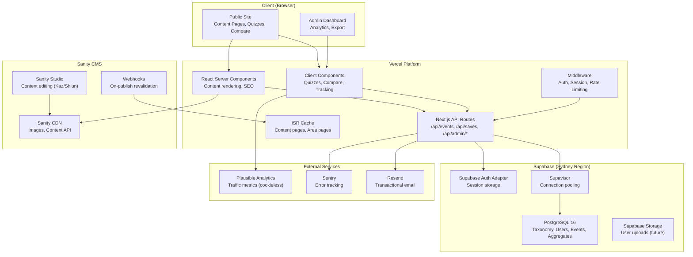
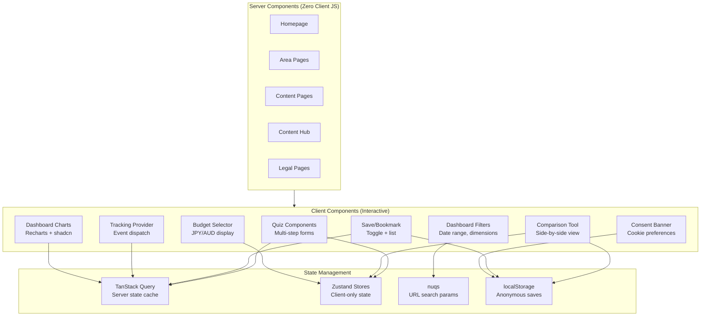
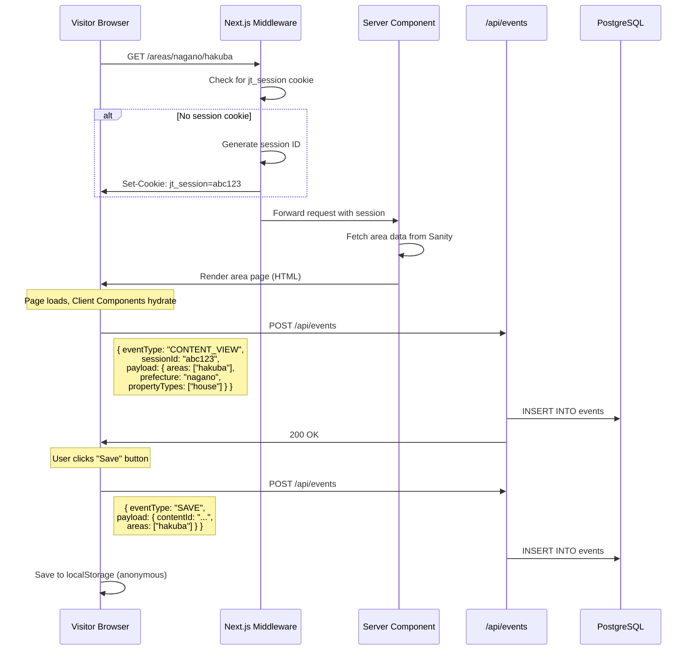
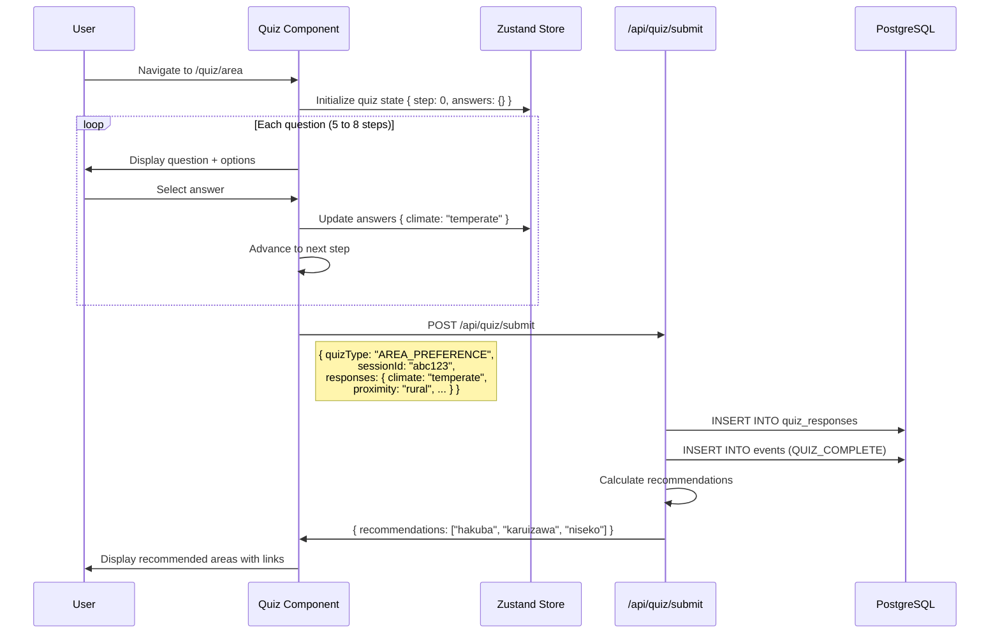
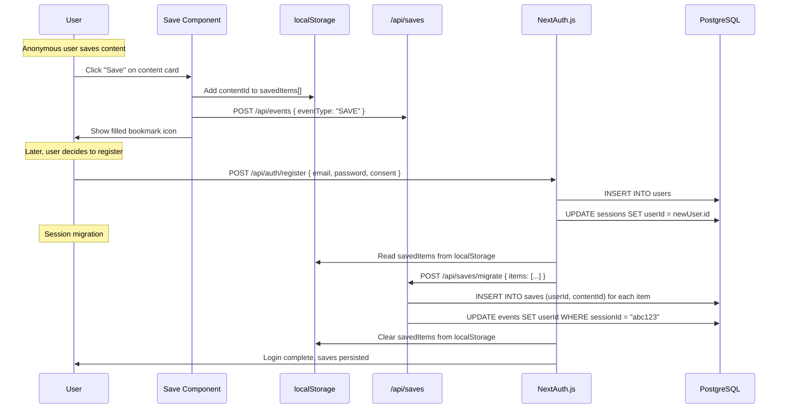
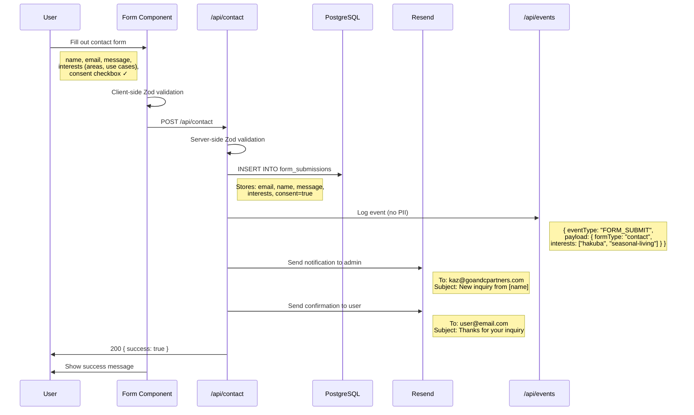
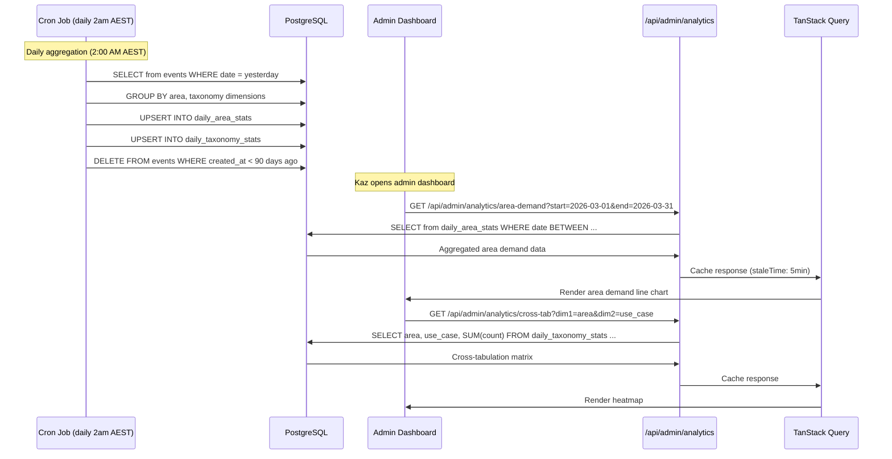
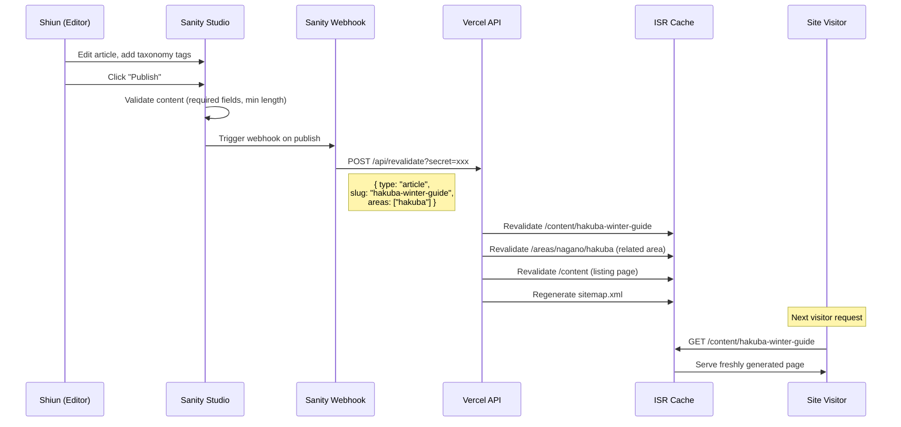
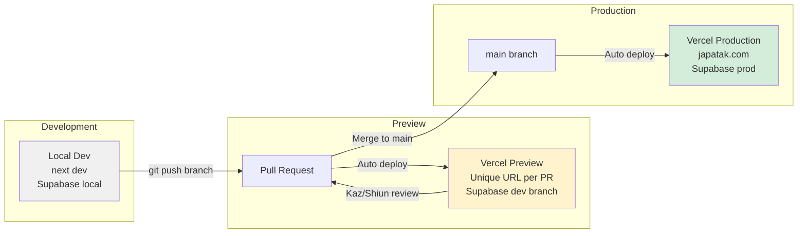

# System Architecture Overview

**Project:** Japanoma — Buyer Insight Platform for Japan Property Investment
**Version:** 1.0
**Date:** 2026-02-27
**Author:** Obi (Technical Lead, Craefto)

---

## 1. High-Level Architecture



## 2. Component Responsibilities

| Component | Responsibility | Technology | ADR |
|-----------|---------------|------------|-----|
| Public Site | Content display, SEO pages, educational content | Next.js 15 RSC | ADR-001 |
| Admin Dashboard | Analytics views, chart rendering, data export | Next.js 15 Client Components + Recharts | ADR-009 |
| API Routes | Event ingestion, CRUD operations, auth, analytics queries | Next.js API Routes + Drizzle ORM | ADR-002 |
| Middleware | Session creation, auth verification, rate limiting, CSRF | Next.js Middleware | ADR-003 |
| ISR Cache | Cached content pages, revalidated on CMS publish | Vercel Edge Cache | ADR-010 |
| Sanity CMS | Content authoring, taxonomy tagging, media management | Sanity Studio + GROQ | ADR-004 |
| Sanity CDN | Image delivery with transformations, content API | Sanity Asset Pipeline | ADR-004 |
| PostgreSQL | Taxonomy, users, sessions, events, aggregates | Supabase PostgreSQL 16 | ADR-002 |
| Auth Adapter | Session persistence, user storage for NextAuth.js | Supabase + NextAuth v5 | ADR-003 |
| Connection Pooler | Serverless connection management | Supavisor (Supabase) | ADR-002 |
| Plausible | Traffic analytics (sessions, referrers, devices) | Plausible Cloud (cookieless) | ADR-005 |
| Sentry | Error tracking, performance monitoring | Sentry Cloud | — |
| Resend | Welcome emails, contact form notifications | Resend API | — |

## 3. Client Architecture



### State Layer Mapping

| Feature | Server State (TanStack Query) | Client State (Zustand) | URL State (nuqs) | Local Storage |
|---------|------------------------------|----------------------|------------------|--------------|
| Content listing | Content items, pagination | — | Filters (area, type, price) | — |
| Area pages | Area data, related content | — | — | — |
| Save/bookmark | Saved items (authenticated) | — | — | Saves (anonymous) |
| Quiz | Recommendations (result) | Current step, answers | Quiz type | — |
| Comparison tool | — | Selected items (up to 3) | — | Selected items |
| Budget selector | — | Selected range | — | — |
| Admin dashboard | Analytics data, aggregates | — | Date range, dimensions, granularity | — |
| Consent | — | — | — | Consent preference |

## 4. Data Flow Diagrams

### 4.1 Anonymous Visitor Browsing and Event Tracking



### 4.2 Quiz Completion Flow



### 4.3 Save/Bookmark Flow (Anonymous to Authenticated)



### 4.4 Contact/Inquiry Form Submission



### 4.5 Admin Analytics Data Flow



### 4.6 Content Publishing Flow (CMS to Live Site)



## 5. Deployment Architecture



### Environment Configuration

| Environment | URL | Database | CMS | Purpose |
|-------------|-----|----------|-----|---------|
| Development | localhost:3000 | Supabase local (Docker) | Sanity dev dataset | Feature development |
| Preview | pr-[N].vercel.app | Supabase dev branch | Sanity dev dataset | Sprint review with Kaz/Shiun |
| Production | japatak.com | Supabase prod (Sydney) | Sanity prod dataset | Live site |

## 6. Caching Strategy

| Resource | Cache Location | TTL | Invalidation |
|----------|---------------|-----|-------------|
| Content pages (area, article) | Vercel ISR Edge Cache | 1 hour default | On-demand via Sanity webhook |
| Content listing pages | Vercel ISR Edge Cache | 1 hour | On-demand via Sanity webhook |
| Sanity images | Sanity CDN | 365 days | URL-based (content-hash in URL) |
| Static assets (JS, CSS) | Vercel CDN | Immutable (content-hash) | New deploy generates new hashes |
| API responses (public) | TanStack Query client cache | 5 minutes | Background refetch |
| API responses (admin) | TanStack Query client cache | 5 minutes | Manual refresh button |
| Taxonomy data | TanStack Query client cache | 30 minutes | Infrequent changes |
| User saves | TanStack Query client cache | 0 (always fresh) | Optimistic update on save/unsave |
| Anonymous saves | localStorage | Indefinite | Cleared on session migration |
| Consent preference | Cookie (jt_consent) | 365 days | User changes via footer link |

## 7. Performance Budget

| Metric | Target | Strategy |
|--------|--------|----------|
| LCP (Largest Contentful Paint) | < 2.5s | Server Components for content pages; Sanity CDN for images with `loading="eager"` on hero |
| FID (First Input Delay) / INP | < 100ms | Minimal client JS on content pages; dynamic imports for interactive components |
| CLS (Cumulative Layout Shift) | < 0.1 | Explicit dimensions on images; font-display: swap with preloaded fonts |
| TTFB (Time to First Byte) | < 600ms | ISR cached pages; Vercel Edge in Sydney |
| Bundle size (content pages) | < 80KB JS | Server Components eliminate client-side React for static content |
| Bundle size (dashboard) | < 200KB JS | Dynamic imports for Recharts; code-split per dashboard view |
| API response time (public) | < 300ms | Indexed queries; Supavisor connection pooling |
| API response time (admin) | < 1s | Aggregated tables; no raw event queries in API |
| Image delivery | < 500ms | Sanity CDN with WebP format; responsive `srcset` |

## 8. SEO Architecture

### Route Structure

```
/                                    → Homepage (content platform overview)
/about                               → About Go&C Partners, mission
/areas                               → Area listing (all prefectures/cities)
/areas/[prefecture]                  → Prefecture overview
/areas/[prefecture]/[city]           → City/area detail page
/content                             → Content hub (all articles/guides)
/content/[slug]                      → Individual article/guide
/quiz/area                           → Area preference quiz
/quiz/use-case                       → Use case quiz
/quiz/design                         → Design style quiz
/compare                             → Comparison tool
/saved                               → Saved items (user or localStorage)
/contact                             → Contact/inquiry form
/privacy                             → Privacy policy
/terms                               → Terms of service
/admin                               → Dashboard home (protected)
/admin/areas                         → Area demand analytics
/admin/use-cases                     → Use case distribution
/admin/design                        → Design preferences
/admin/pricing                       → Price range analysis
/admin/cross-tab                     → Cross-tabulation views
/admin/export                        → Data export
```

### Metadata Strategy

| Page Type | Title Pattern | Description Source | Structured Data |
|-----------|--------------|-------------------|----------------|
| Homepage | "Japanoma — Japan Property Investment Insights" | Static | Organization, WebSite |
| Area listing | "Explore Japan Property Areas — Japanoma" | Static | BreadcrumbList |
| Area detail | "{Area Name} Property Guide — Japanoma" | Sanity CMS excerpt | Place, BreadcrumbList |
| Article | "{Title} — Japanoma" | Sanity CMS excerpt | Article, BreadcrumbList |
| Quiz | "Find Your Ideal {Quiz Type} — Japanoma" | Static | BreadcrumbList |
| Contact | "Get in Touch — Japanoma" | Static | BreadcrumbList |

### Sitemap Generation

Dynamic `sitemap.xml` generated via Next.js `sitemap()` function. Pulls all published content slugs from Sanity at build time and regenerates on content publish via ISR.

---

*Cross-references: [ADR-001](../adr/001-framework-nextjs-15.md) (Framework), [ADR-002](../adr/002-database-and-orm.md) (Database), [ADR-004](../adr/004-cms-choice.md) (CMS), [ADR-005](../adr/005-analytics-tracking.md) (Analytics), [ADR-010](../adr/010-deployment.md) (Deployment), [ADR-011](../adr/011-seo-strategy.md) (SEO), [Data Model](data-model.md), [Auth Spec](auth-spec.md)*
